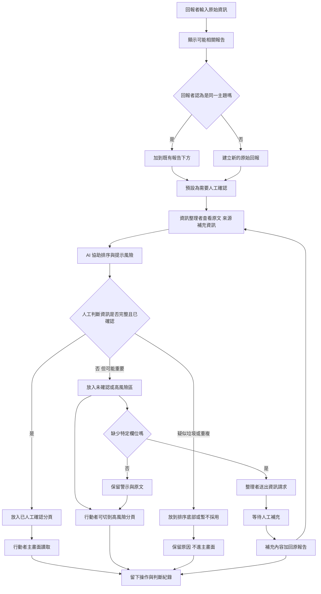

# 資訊流程設計

> 這份文件可以由 Codex 先產生草稿，但你必須用 VS Code 預覽 Mermaid，並由人檢查流程是否合理。

## 我的 v1 目標

- 我優先服務的使用者：行動者，但流程也保留回報者與資訊整理者的位置。
- 這個使用者最想完成的事：快速看懂哪些報告是已人工確認、哪些報告仍有風險，以及需要補問哪些資訊。
- 我最想避免的錯誤：把未確認資訊、AI 整理或高急迫回報誤當成正式任務或出發指令。

## 自然語言流程描述

```text
回報者輸入原始資訊時，系統先用文字比對顯示可能相關的既有報告。
如果回報者認為是同一主題，可以把新內容加到既有報告下方；否則建立新的原始回報。
所有新回報和補充資訊都預設為需要人工確認。

資訊整理者查看原文、來源、補充資訊和 AI 排序提示。
AI 只能協助排序與提示可能風險，不能判定資訊是否為真，也不能決定派工或救災優先順序。

整理者用人工判斷把報告分流：
已人工確認且資訊完整的報告，進入「已人工確認」分頁。
資訊不足但可能重要的報告，進入「未確認 / 高風險」或 AI 排序區，並顯示警示。
疑似垃圾或重複轉貼，放到排序底部或暫不採用，但仍保留原因。
如果缺少特定欄位，整理者送出資訊請求，請人補問地點、時間、接收條件或回報者身分。
收到回覆後，補充內容會加回原報告，再由整理者重新人工分流。

行動者主畫面只讀取已人工確認報告。
行動者也可以切到未確認 / 高風險資訊，但畫面必須明確提醒：這些不是正式任務，是否採取下一步必須由人判斷。
每次新增、補充、分流、人工確認、退回確認、送出資訊請求或收到回覆，都要留下紀錄。
```

## Mermaid 流程圖

請用 VS Code 預覽，確認流程圖能正常顯示。



## 人工確認點

- 判斷新回報是否和既有報告是同一主題。
- 判斷一筆報告是否已人工確認且資訊完整。
- 判斷報告要進入已人工確認、未確認 / 高風險、疑似垃圾或暫不採用。
- 判斷缺少哪些欄位，需要送出資訊請求。

## 不能自動處理的分支

- AI 不能判定資訊是否為真。
- AI 不能決定救災、派工、路線或行動優先順序。
- 系統不能因為高急迫就自動標成可信或可行動。
- 系統不能自動判定兩筆相似報告一定是同一事件。
- 未確認資訊不能被顯示成已人工確認。

## 操作或判斷紀錄

- 新增原始回報。
- 把新內容加到既有報告下方。
- 人工確認報告。
- 退回需要確認。
- 標示疑似垃圾或暫不採用。
- 送出資訊請求。
- 收到資訊請求的回覆。
- 將報告放入行動者主畫面或未確認 / 高風險分頁。

## 我檢查後修正了什麼

- 原本：流程可能直接從 AI 排序進到行動者畫面，容易讓 AI 看起來像決策者。
- 修正後：AI 只做排序與提示，之後一定進入人工判斷節點。
- 為什麼：符合檢查表中「流程沒有讓 AI 自動決定資訊是否為真」與「沒有讓 AI 自動決定救災、派工或行動優先順序」。

## 我仍不確定的流程點

- 主畫面和未確認 / 高風險分頁之間，最後要完全人工分流，還是先依狀態初步分組。
- 局部確認要先用文字紀錄，還是做成欄位級狀態。
- 行動者看到未確認 / 高風險分頁時，警示文字要多強，才不會被誤讀成任務。
- 資訊請求回覆後，要用單一狀態重新分流，還是保留欄位級紀錄。
